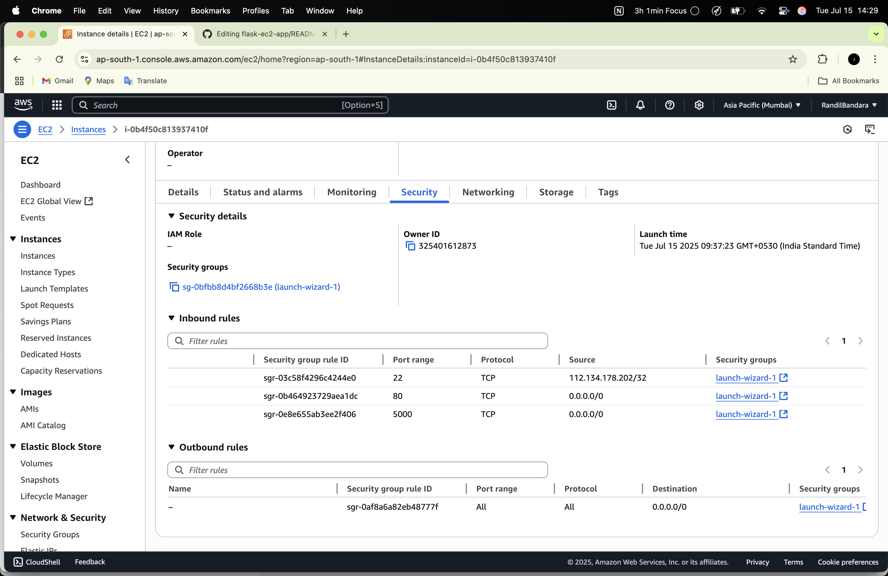
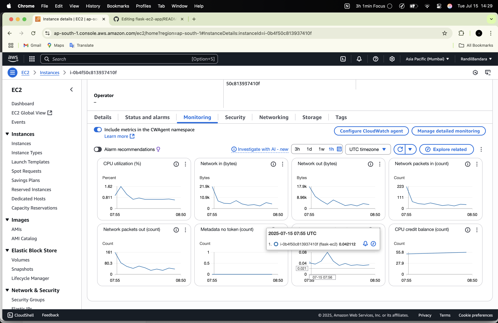

# Flask EC2 App

## Overview

This is a simple Flask web application deployed on an AWS EC2 instance.

## What I’ve Done

1. **Built Flask App Locally**  
   Developed a simple Flask web app (can be either a web app or API).

2. **Launched EC2 Instance**  
   Created an AWS EC2 instance (t2.micro Free Tier) and connected via SSH.

3. **Deployed with Gunicorn + Nginx**  
   Set up Gunicorn as the WSGI server and configured Nginx as a reverse proxy for production readiness.

4. **Configured Security Groups**  
   Opened necessary HTTP and HTTPS ports on EC2 Security Groups to allow web traffic.
   
IP - 13.201.78.169
=======
# My Flask EC2 App

This is my Flask app deployed on EC2.

## Screenshots

Here are some screenshots of the app:

